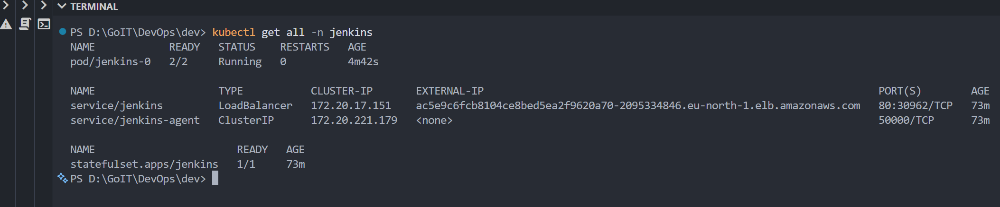
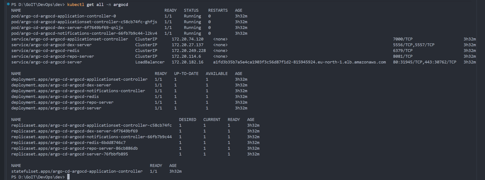
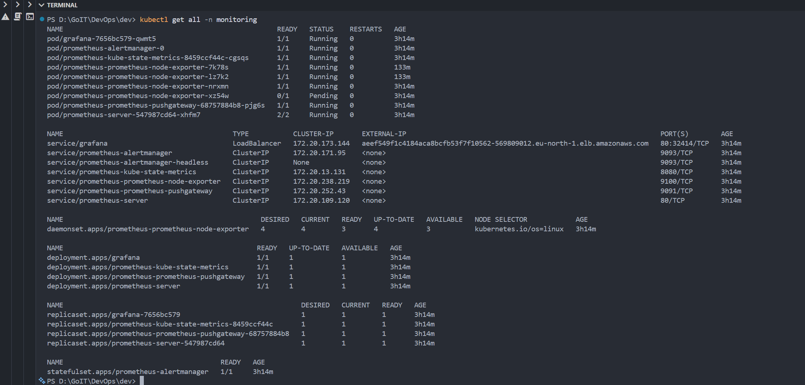
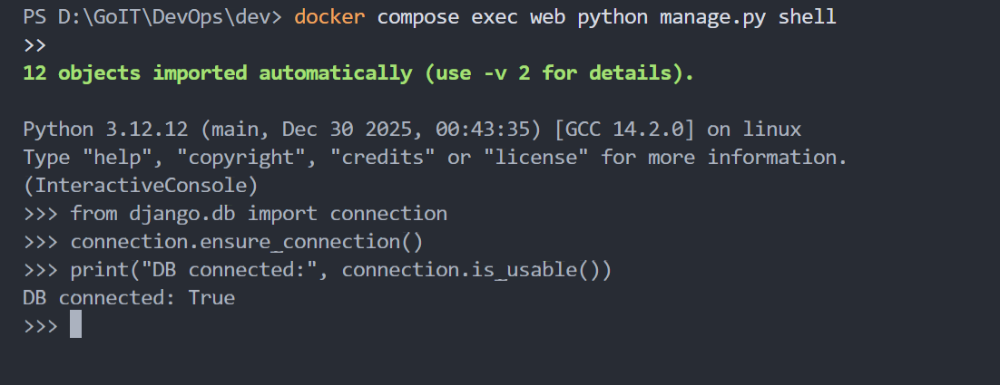
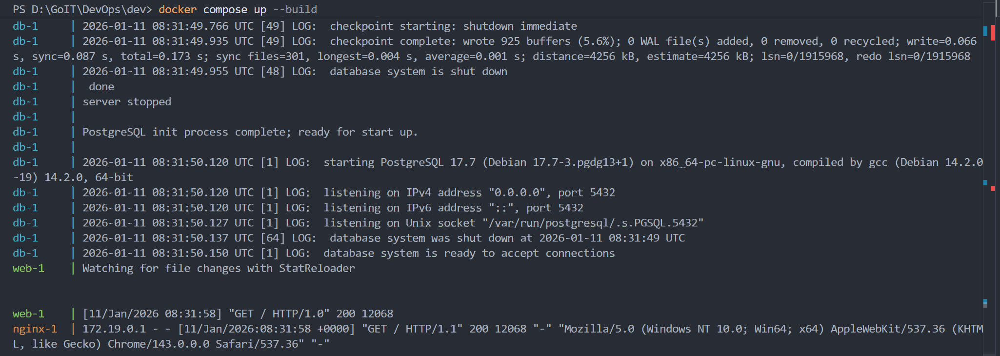

# DevOps Final Project: AWS Cloud Infrastructure & GitOps

Цей проєкт представляє собою повний цикл розгортання хмарної інфраструктури в AWS за допомогою **Terraform** та реалізацію GitOps-процесів з використанням **Argo CD**, **Jenkins** та стеку моніторингу (**Prometheus** & **Grafana**).

## 🏗 Архітектура проекту

Проєкт складається з наступних ключових компонентів:
- **VPC**: Мережева інфраструктура з публічними та приватними підмережами.
- **EKS**: Managed Kubernetes кластер для запуску сервісів.
- **RDS (Aurora/PostgreSQL)**: Керована база даних.
- **ECR**: Репозиторій для Docker-образів.
- **Jenkins**: CI/CD інструмент для автоматизації збірки.
- **Argo CD**: GitOps оператор для автоматичного деплою додатків.
- **Prometheus & Grafana**: Повний стек моніторингу та візуалізації метрик.

## 📂 Структура репозиторію

```text
Project/
│
├── main.tf               # Головний файл для підключення модулів
├── backend.tf            # Налаштування бекенду для стейтів (S3 + DynamoDB)
├── outputs.tf            # Загальні виводи ресурсів та команди доступу
│
├── modules/              # Каталог з усіма модулями інфраструктури
│  ├── s3-backend/        # Модуль для S3 та DynamoDB (Terraform State)
│  │  ├── s3.tf
│  │  ├── dynamodb.tf
│  │  ├── variables.tf
│  │  └── outputs.tf
│  │
│  ├── vpc/               # Мережа AWS (VPC, Subnets, Routing)
│  │  ├── vpc.tf
│  │  ├── routes.tf
│  │  ├── variables.tf
│  │  └── outputs.tf
│  │
│  ├── ecr/               # Docker Registry для образів додатка
│  │  ├── ecr.tf
│  │  ├── variables.tf
│  │  └── outputs.tf
│  │
│  ├── eks/               # Kubernetes кластер та EBS CSI Driver
│  │  ├── eks.tf
│  │  ├── aws_ebs_csi_driver.tf
│  │  ├── node.tf
│  │  ├── variables.tf
│  │  └── outputs.tf
│  │
│  ├── rds/               # База даних (Aurora або RDS Instance)
│  │  ├── rds.tf
│  │  ├── aurora.tf
│  │  ├── shared.tf
│  │  ├── variables.tf
│  │  └── outputs.tf
│  │ 
│  ├── jenkins/           # Автоматизація CI/CD (Helm)
│  │  ├── jenkins.tf
│  │  ├── Jenkinsfile
│  │  ├── variables.tf
│  │  ├── providers.tf
│  │  ├── values.yaml
│  │  └── outputs.tf
│  │ 
│  └── argo_cd/           # GitOps та моніторинг (Helm + App-of-Apps)
│    ├── argocd.tf
│    ├── variables.tf
│    ├── providers.tf
│    ├── values.yaml
│    ├── outputs.tf
│    └── charts/          # Внутрішній чарт для розгортання додатків
│      ├── Chart.yaml
│      ├── values.yaml    # Опис Prometheus, Grafana, Django App
│      └── templates/
│        ├── application.yaml
│        ├── repository.yaml
│        └── prometheus-extra-rbac.yaml
│
├── charts/               # Helm чарти додатків
│  └── django-app/        # Маніфести для Django додатка
│    ├── templates/
│    ├── Chart.yaml
│    └── values.yaml
│
└── Django/               # Вихідний код додатка
    ├── app/
    ├── Dockerfile
    ├── Jenkinsfile
    ├── manage.py
    ├── requirements.txt      # Залежності Python
    └── docker-compose.yaml
```

## 🚀 Етапи виконання (Інструкція)

### 1. Підготовка середовища
- Встановіть `terraform`, `kubectl`, `helm` та `aws-cli`.
- Налаштуйте доступ до AWS (`aws configure`).
- Ініціалізуйте проект:
  ```powershell
  terraform init
  ```

### 2. Розгортання інфраструктури
Виконайте команду для створення всіх ресурсів в AWS:
```powershell
terraform apply
```

### 3. Перевірка стану компонентів
Після завершення (зазвичай 15-20 хв), перевірте статус подів у відповідних просторах імен:
```powershell
kubectl get all -n jenkins
kubectl get all -n argocd
kubectl get all -n monitoring
```




### 4. Доступ до інструментів
Використовуйте `port-forward` для доступу до UI (команди також будуть доступні в `terraform outputs`):

| Інструмент | Команда для доступу | URL |
| :--- | :--- | :--- |
| **Jenkins** | `kubectl port-forward svc/jenkins 8080:80 -n jenkins` | http://localhost:8080 |
| **Argo CD** | `kubectl port-forward svc/argo-cd-argocd-server 8081:443 -n argocd` | https://localhost:8081 |
| **Grafana** | `kubectl port-forward svc/grafana 3000:80 -n monitoring` | http://localhost:3000 |
| **Prometheus**| `kubectl port-forward svc/prometheus-server 9090:80 -n monitoring` | http://localhost:9090 |





> **Credentials**:
> - **Argo CD**: `admin` / (пароль генерується автоматично в секретах)
> - **Grafana**: `admin` / `admin123`

## 📊 Моніторинг
Стек моніторингу вже налаштований для збору метрик з вузлів (Node Exporter) та контейнерів (cAdvisor). В Grafana автоматично додано Prometheus як Data Source.

---
*Виконав: [Ваше Ім'я]*
  parameters = {
    max_connections = "200"
  }
}
```

### Опис змінних

| Змінна | Опис | Тип | За замовчуванням |
| :--- | :--- | :--- | :--- |
| `name` | Назва ресурсу (буде використана як префікс для SG, PG, Subnet Group) | `string` | - |
| `use_aurora` | Вибір типу БД: `true` — Aurora Cluster, `false` — RDS Instance | `bool` | `false` |
| `engine` | Тип БД (двигун) для звичайного RDS (postgres, mysql, etc.) | `string` | `"postgres"` |
| `engine_cluster` | Тип БД для Aurora (aurora-postgresql, aurora-mysql) | `string` | `"aurora-postgresql"` |
| `engine_version` | Версія двигуна для RDS | `string` | `"14.7"` |
| `engine_version_cluster` | Версія двигуна для Aurora | `string` | `"15.3"` |
| `instance_class` | Клас потужності інстансу | `string` | `"db.t3.micro"` |
| `allocated_storage` | Обсяг диска в ГБ (тільки для RDS) | `number` | `20` |
| `db_name` | Назва бази даних при створенні | `string` | - |
| `username` | Логін адміністратора | `string` | - |
| `password` | Пароль адміністратора (Sensitive) | `string` | - |
| `vpc_id` | ID VPC для створення Security Group | `string` | - |
| `subnet_private_ids` | Список ID приватних підмереж для Subnet Group | `list(string)` | - |
| `subnet_public_ids` | Список ID публічних підмереж (якщо `publicly_accessible = true`) | `list(string)` | - |
| `publicly_accessible` | Чи дозволяти доступ до БД з публчних мереж | `bool` | `false` |
| `multi_az` | Режим високої доступності (Multi-AZ) | `bool` | `false` |
| `parameters` | Мапа кастомних параметрів для Parameter Group | `map(string)` | `{}` |

### Як змінити конфігурацію

1.  **Тип бази даних**: Використовуйте `use_aurora = true` для кластера Aurora (краще підходить для високих навантажень) або `use_aurora = false` для дешевших інстансів.
2.  **Двигун (Engine)**: Змініть `engine` (для RDS) або `engine_cluster` (для Aurora). Також не забудьте оновити `parameter_group_family_rds` або `parameter_group_family_aurora` відповідно до версії.
3.  **Клас інстансу**: Параметр `instance_class` дозволяє масштабувати ресурси (CPU/RAM).
4.  **Параметри БД**: Модуль автоматично створює `Parameter Group`. Ви можете передати список параметрів через мапу `parameters`, і вони будуть додані до стандартних (`max_connections`, `log_statement`, `work_mem`).
